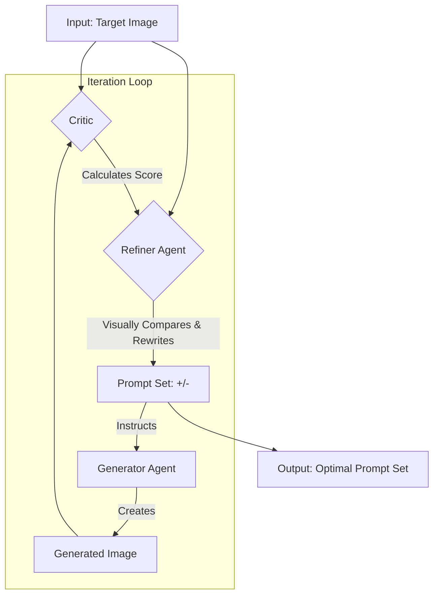

<pre>
   <div align="center">
     $$$$$   $$$$$      $$$$$      $$$$$    $$    $$  $$$$$$ 
  $$       $$   $$   $$   $$    $$   $$   $$    $$  $$   
  $$  $$   $$ $$    $$     $$  $$     $$  $$    $$  $$$$$
  $$   $$  $$  $$    $$   $$    $$   $$    $$  $$   $$   
    $$$$$   $$   $$    $$$$$      $$$$$       $$     $$$$$$
   </div>   
</pre>

# GROOVE: A Generative Refinement Framework Using Vision-Language Feedback Loops

## Overview
GROOVE is an innovative agentic system designed to bridge the semantic gap in text-to-image synthesis by autonomously refining prompts to accurately reproduce a target visual concept. By leveraging a self-correcting feedback loop with specialized AI agents, GROOVE iteratively optimizes both positive and negative prompts, achieving high-fidelity image generation without requiring extensive user expertise.

## System Architecture
GROOVE's architecture is inspired by the adversarial dynamics of GANs, featuring three specialized agents operating in a continuous feedback loop:

- **Generator Agent ("The Artist")**: Utilizes Stable Diffusion XL to synthesize images based on the current prompt set.
- **Critic Agent ("The Comparator")**: Employs CLIP to calculate semantic similarity scores between the target and generated images, providing objective feedback.
- **Refiner Agent ("The Visual Analyst")**: Powered by Google Gemini 1.5 Pro, this multimodal LLM performs visual difference analysis and refines prompts to minimize errors in subsequent iterations.

The workflow is illustrated below:



## Key Features
- **Agentic Workflow**: Modular agents mimic a human expert's creative process through iterative prompt refinement.
- **Vision-Based Feedback**: Uses a multimodal LLM for precise visual discrepancy analysis, surpassing text-only methods.
- **Dual Prompt Generation**: Automatically engineers detailed positive and negative prompts for optimal output quality.
- **Quantitative Optimization**: Leverages CLIP similarity scores to drive measurable improvements.
- **Plug-and-Play**: Easily deployable locally or on Google Colab with minimal setup.

## Applications
- **Automated Content Creation**: Generate on-brand marketing assets from target image mood boards.
- **Scientific Visualization**: Produce clear, illustrative figures for research papers from reference diagrams.
- **Personalized Design**: Create custom artwork matching a user's environment from uploaded photos.
- **Generative Model Auditing**: Analyze model biases by targeting sensitive images and reviewing resulting prompts.

## Setup and Installation

### Prerequisites
- **Hardware**: NVIDIA GPU with at least 16GB VRAM (e.g., RTX 3090, 4090, or A100).
- **Software**: Python 3.9 or higher.
- **OR**: Google Colab T4/L4 GPU
- **API Key**: Google Gemini API Key for the Refiner Agent.

### Installation Steps
1. **Clone the Repository**:
   ```bash
   git clone https://github.com/your-username/GROOVE.git
   cd GROOVE
   ```

2. **Set Up Virtual Environment**:
   ```bash
   python -m venv venv
   source venv/bin/activate  # On Windows: venv\Scripts\activate
   ```

3. **Install Dependencies**:
   ```bash
   uv pip install -r requirements.txt
   or
   !pip install -q transformers diffusers torch accelerate scipy Pillow tqdm google-generativeai (for colab)
   ```

4. **Configure Gemini API Key**:
   - **Google Colab**: Add your key to the Secrets manager (🔑 icon):
     - Name: `GEMINI_API_KEY`
     - Value: `your-api-key-pasted-here`
   - **Local Execution**: Set as an environment variable:
     ```bash
     export GEMINI_API_KEY=your-api-key-pasted-here  # On Windows: set GEMINI_API_KEY=your-api-key-pasted-here
     or
     save it to colab secrets
     ```

5. **Run the System**:
   - Place your target image in the root directory as `my_image.jpg`.
   - Execute:
     ```bash
     python groove_main.py
     ```
   - Results are saved to the `output/` directory.

## Future Research Directions
- **Multi-Objective Optimization**: Incorporate aesthetic scores and prompt conciseness into the reward function.
- **Hierarchical Prompt Decomposition**: Enable structured prompts with weighted keywords for finer control.
- **Human-in-the-Loop Integration**: Allow high-level human feedback to guide refinement.
- **Cross-Modal Generalization**: Extend the framework to text-to-music or text-to-video generation.

## Contributing
Contributions are welcome! For major changes, please open an issue to discuss your ideas. Pull requests should follow the project's coding standards and include relevant tests.

## Citation
If you use GROOVE in your research, please cite:

```bibtex
@misc{groove2025,
  author       = {Akshay Sasi},
  title        = {GROOVE: A Generative Refinement Framework Using Vision-Language Feedback Loops},
  year         = {2025},
  publisher    = {AkshaySasi},
  journal      = {GROOVE},
  howpublished = {\url{https://github.com/AkshaySasi/GROOVE}}
}
```

## License
This project is licensed under the MIT License. See the `LICENSE` file for details.
